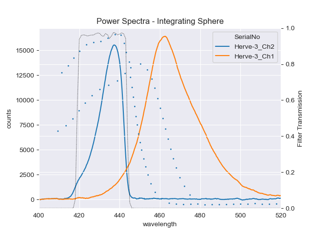

# BetterFluorometer
## What is a Better Chlorophyll Fluorometer?  A poster for Ocean Sciences 2022.

Chlorophyll fluorometers are inexpensive, easy to use, and consume little power. Their deployment in global and regional observation systems forms a basis for understanding primary production and ocean carbon cycles via estimates of chlorophyll concentration as a proxy for phytoplankton biomass. Yet studies have shown large global biases in estimates of chlorophyll concentration based on fluorometry[1](#roesler2017). What can we learn from our knowledge of spectral absorption of various phytoplankton photosynthetic and photoprotective pigments both common to, and diverse across, various species that can help produce a fluorometer with less global variability? How can we create a calibration standard for fluorometers that leads to open, traceable, and repeatable calibrations that correspond to a global mean? We present some design ideas, calibration experiments, and in situ field results that light the way towards the "better chlorophyll fluorometer".

<a name="roesler2017">1</a>. Roesler, C., Uitz, J., Claustre, H., Boss, E., Xing, X., Organelli, E., Briggs, N., Bricaud, A., Schemchtig, C., Poteau, A., D'Ortenzio, F., Ras, F., Drapeau, J., Haëntjens, N., and Barbieux, M. (2017). Recommendations for obtaining unbiased chlorophyll estimates from in situ chlorophyll fluorometers: A global analysis of WET Labs ECO sensors. Limnology and Oceanography: Methods, 15(6), 572-585.
